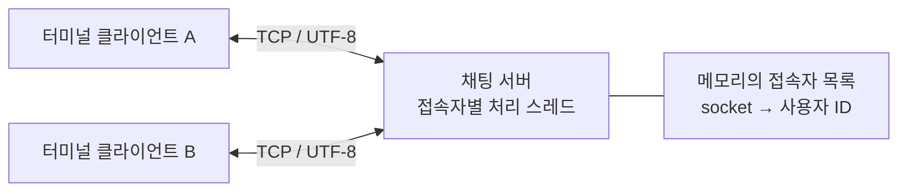

# TCP CLI Chat

**Python 표준 라이브러리로 구현한 터미널 채팅 서버·클라이언트입니다.** TCP 소켓으로 메시지를 전달하고 스레드로 여러 연결과 메시지 수신을 처리합니다.

서버에 등록된 계정으로 로그인한 뒤 같은 서버에 연결된 사용자끼리 대화합니다. 같은 계정으로 다시 접속하면 기존 연결을 종료하고 새 연결을 사용할지 선택할 수 있습니다.

## 구현 기능

| 기능 | 구현 방식 |
| --- | --- |
| 로그인 | 서버의 등록 계정과 ID·비밀번호 비교 |
| 메시지 전달 | 발신자 ID를 붙여 다른 접속자에게 브로드캐스트 |
| 입장·퇴장 알림 | 접속자 목록 변경 시 다른 클라이언트에 안내 |
| 중복 계정 접속 | 새 접속에서 기존 세션 종료 여부를 선택 |
| 터미널 입출력 | 메인 스레드의 키보드 입력과 별도 스레드의 수신 출력 |
| 종료 | 클라이언트에서 `quit` 입력 |

## 통신 구조



서버는 로그인 요청을 처리한 뒤 메시지마다 발신자 ID를 붙여 **발신자를 제외한 접속자**에게 전송합니다. 클라이언트는 수신 스레드에서 상대방의 메시지를 출력하며 메인 스레드에서는 키보드 입력을 받습니다.

## 코드 구성

```text
tcp-cli-chat/
├── server/
│   ├── chat_server.py   # 로그인·세션·브로드캐스트
│   ├── start.sh         # 백그라운드 서버 시작
│   └── stop.sh          # 서버 중지
├── client/
│   └── chat_client.py   # 로그인·메시지 송수신
└── docs/
    ├── SETUP.md         # 설정과 실행 순서
    └── DEMO.md          # 동작 확인 기록
```

외부 Python 패키지 없이 표준 라이브러리의 `socket`, `threading`, `getpass` 등을 사용합니다. 사용법과 시연은 [실행 안내](docs/SETUP.md), [동작 기록](docs/DEMO.md)에 정리했습니다.

## 실행하기

```bash
git clone https://github.com/ho72/tcp-cli-chat.git
cd tcp-cli-chat
```

서버는 `CHAT_USERS_JSON`에서 로그인 계정을 읽습니다. [실행 안내의 가려진 입력 방법](docs/SETUP.md)을 사용하면 실제 값을 소스·셸 기록에 넣지 않고 서버를 시작할 수 있습니다. 계정 설정이 없으면 서버는 시작하지 않습니다.

서버를 실행한 뒤 다른 터미널에서 클라이언트를 실행합니다.

```bash
python3 client/chat_client.py
```

서버와 클라이언트는 기본적으로 로컬 `127.0.0.1:5000`을 사용합니다. 주소·포트는 환경변수로 변경할 수 있고, 예전 외부 서버 주소나 고정 로그인 값을 코드에 넣지 않습니다.

## 동작 확인

2026.10.06, Python 3.14.6에서 실제 서버와 두 터미널 클라이언트를 로컬로 실행해 양방향 채팅, 입장·퇴장 알림, 로그인 실패, 중복 접속 유지·교체, `quit` 종료를 확인했습니다. 계정 설정 오류 처리와 백그라운드 시작·중지 스크립트도 검증했습니다.

[동작 확인 기록](docs/DEMO.md)에 실제 터미널 출력과 검증 범위를 남겼습니다. 테스트는 실행 중 생성한 임시 계정을 사용했으며 비밀번호를 기록하지 않았습니다.

## 현재 구현 범위

- 하나의 서버에서 모든 접속자가 같은 대화에 참여합니다. 채팅방·개인 메시지·대화 저장 기능은 없습니다.
- TCP는 바이트 스트림이며 현재 프로토콜에는 길이 헤더·구분자를 이용한 메시지 경계 처리가 없습니다. 한 번의 `recv(1024)`로 메시지를 읽는 구현이라 분할·합쳐진 패킷과 큰 메시지를 안정적으로 처리하는 완성된 프로토콜은 아닙니다.
- 클라이언트의 연결이 종료되어도 메인 스레드가 터미널 입력을 기다릴 수 있어, 상대 연결 종료 시 사용자 입력을 마저 받아야 종료되는 경우가 있습니다.
- 인증은 구현 흐름을 보여주는 단순 비교입니다. TLS·비밀번호 해싱·지속성 있는 사용자 저장소는 구현하지 않았습니다.
- 접속자 딕셔너리에 별도 잠금이 없고 일부 예외를 무시합니다. 부하·동시성·장시간 운영 검증은 별도 범위입니다.

이 저장소는 TCP 소켓·스레드·터미널 입출력 구현을 보여주는 소규모 프로젝트입니다. 운영 중인 외부 서버나 성능 측정 결과를 전제로 소개하지 않습니다.
